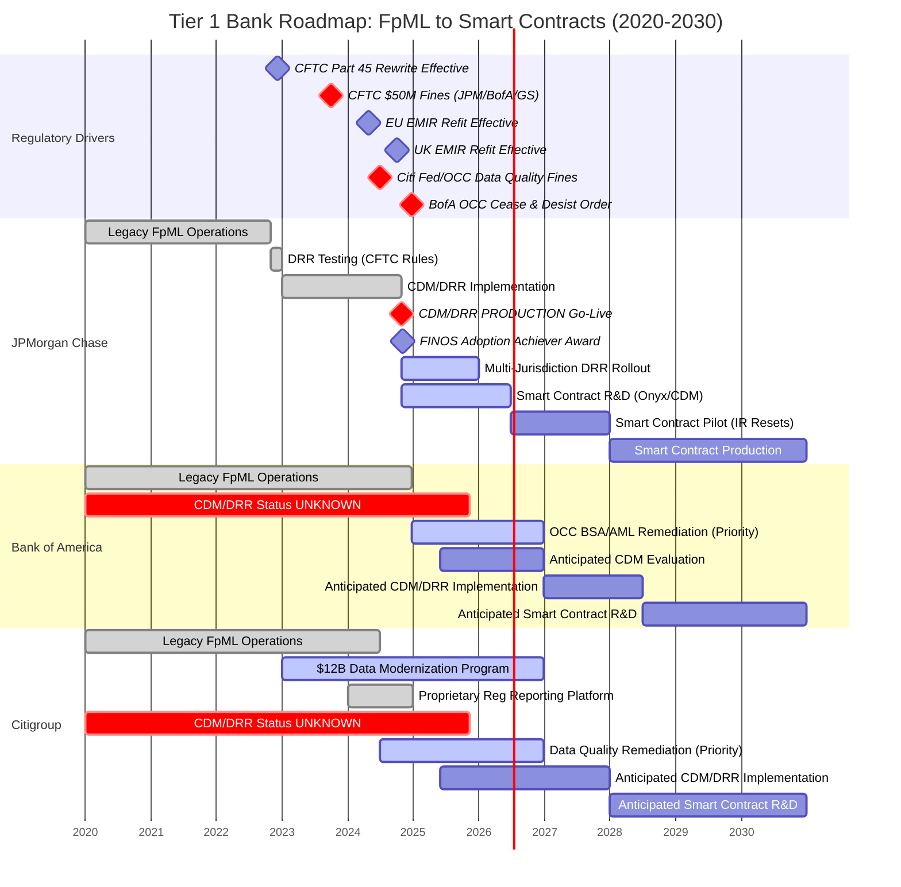
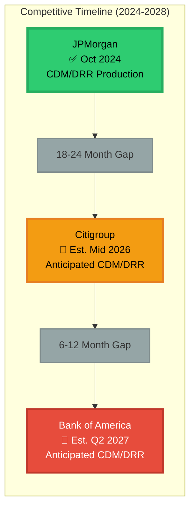
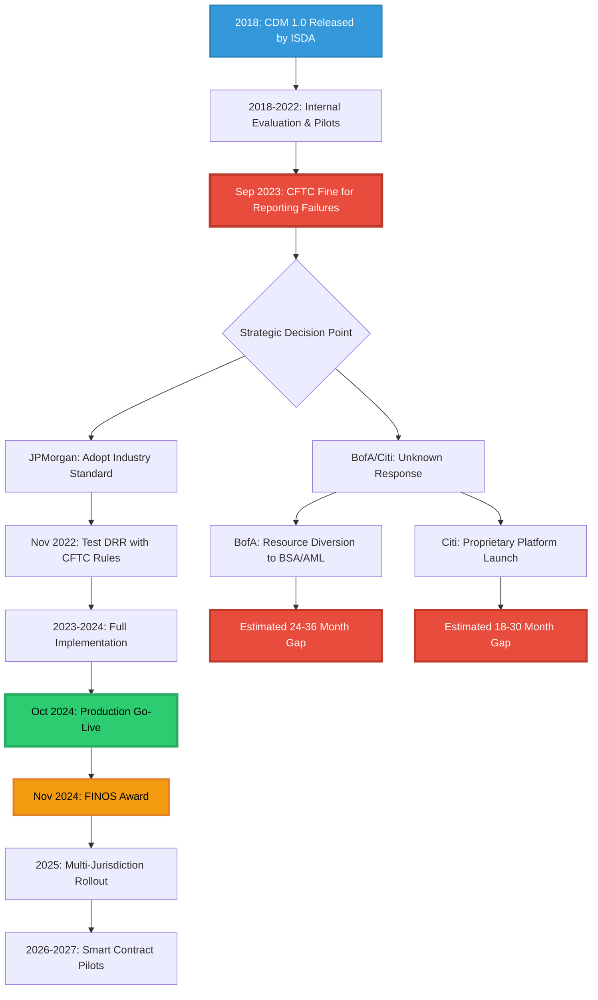

# Visual Roadmap: Tier 1 U.S. Banks Derivatives Technology Evolution
## FpML → CDM → DRR → Smart Contracts (2020-2030)

**Last Updated:** November 10, 2025  
**Disclaimer:** This roadmap is based on publicly available information from ISDA, FINOS, regulatory filings, and industry announcements. Timelines represent high-level adoption phases derived from documented evidence. Future projections (2025-2030) are analytical estimates based on regulatory drivers and competitive positioning.

---

## 📊 Master Timeline: Competitive Positioning



---

## 🎯 Maturity Matrix: Four-Phase Evolution

| Phase | JPMorgan Chase | Bank of America | Citigroup |
|-------|----------------|-----------------|-----------|
| **Phase 1: FpML (2001-2018)**<br/>*Legacy XML messaging standard* | ✅ **OPERATIONAL** (Since 2001)<br/>Universal adoption | ✅ **OPERATIONAL** (Since 2001)<br/>Original FpML co-developer | ✅ **OPERATIONAL** (Since 2001)<br/>ISDA protocol participant |
| **Phase 2: ISDA CDM (2018-Present)**<br/>*Standardized data model* | ✅ **PRODUCTION** (Oct 2024)<br/>First major U.S. bank<br/>FINOS Adoption Achiever 2024 | ❓ **UNKNOWN**<br/>No public announcements<br/>Est. 24-36 months behind JPM | ❓ **UNKNOWN**<br/>Proprietary platform launched 2024<br/>Est. 18-30 months behind JPM |
| **Phase 3: DRR (2022-Present)**<br/>*Automated regulatory reporting* | ✅ **PRODUCTION** (Oct 2024)<br/>Primary reporting mechanism<br/>Multi-jurisdiction (CFTC, EMIR, JFSA) | ❓ **UNKNOWN**<br/>CFTC fine Sep 2023 ($50M)<br/>OCC Cease & Desist Dec 2024 | ❓ **UNKNOWN**<br/>Fed/OCC fines Jul 2024 ($135.6M)<br/>Consent orders active |
| **Phase 4: Smart Contracts (2025-2030)**<br/>*Automated execution* | 🔄 **FOUNDATION LAID**<br/>CDM/DRR infrastructure live<br/>Onyx platform experience<br/>Pilot expected 2026-2027 | 🔮 **FUTURE**<br/>Resource diversion to BSA/AML<br/>Est. pilot 2028-2030 | 🔮 **FUTURE**<br/>R3 consortium member<br/>Est. pilot 2027-2030 |

**Legend:**  
✅ Operational/Production | 🔄 Active Development | ❓ Unknown/Undisclosed | 🔮 Future/Anticipated

---

## 📈 Competitive Gap Analysis



---

## 🔍 Key Milestones & Evidence

### JPMorgan Chase (Documented)

| Date | Milestone | Source |
|------|-----------|--------|
| **Nov 2, 2022** | Successfully tested DRR with CFTC rules (first major U.S. bank) | ISDA announcement |
| **Dec 5, 2022** | CFTC Part 45 Rewrite effective date (regulatory driver) | CFTC Federal Register |
| **Sep 30, 2023** | CFTC fine for swap reporting failures ($50M total with BofA/GS) | CFTC Order 8659-23 |
| **Feb 2023** | CDM transitioned to FINOS open-source governance | FINOS announcement |
| **Oct 2024** | **CDM/DRR Production deployment announced** | JPMorgan Technology Blog |
| **Oct 2024** | "First major U.S. bank to implement CDM/DRR as primary reporting mechanism" | JPMorgan official statement |
| **Nov 2024** | FINOS "Adoption Achiever" Award for CDM/DRR implementation | FINOS Awards |
| **Oct 2025** | ISDA/Tokenovate Smart Contract Taskforce launched | ISDA press release |

### Bank of America (Known Events)

| Date | Event | Impact |
|------|-------|--------|
| **1999** | Co-developer of FpML with JPMorgan/PwC | Legacy foundation |
| **Sep 30, 2023** | CFTC fine for swap reporting failures ($50M total) | Regulatory pressure |
| **Dec 23, 2024** | **OCC Cease & Desist Order (BSA/Sanctions)** | Resource diversion to compliance |
| **2025-Present** | **No public CDM/DRR disclosures found** | Competitive gap widening |

### Citigroup (Known Events)

| Date | Event | Impact |
|------|-------|--------|
| **2023-2024** | $12B+ data modernization investment program | Technology transformation |
| **Jul 2024** | **Fed/OCC fines ($135.6M) for data quality failures** | Regulatory pressure |
| **Jul 2024** | Fed consent order on derivatives unwind deficiencies | Operational remediation |
| **2024** | Proprietary "regulatory reporting platform" launched (technology unspecified) | Unclear if CDM-based |
| **2025-Present** | **No public CDM/DRR disclosures found** | Strategic approach unclear |

---

## ⚠️ Risk Assessment: Strategic Implications

```mermaid
quadrantChart
    title Strategic Risk Matrix: Regulatory Pressure vs. Technology Maturity
    x-axis Low Technology Maturity --> High Technology Maturity
    y-axis Low Regulatory Risk --> High Regulatory Risk
    
    quadrant-1 "Leaders (Low Risk)"
    quadrant-2 "Innovators (Managed Risk)"
    quadrant-3 "Builders (Medium Risk)"
    quadrant-4 "Crisis Zone (High Risk)"
    
    JPMorgan (Oct 2024): [0.95, 0.35]
    Citigroup (Est): [0.30, 0.75]
    Bank of America (Est): [0.25, 0.85]
```

### Critical Success Factors

| Bank | **Current Position** | **Primary Risks** | **Strategic Imperatives** |
|------|---------------------|-------------------|---------------------------|
| **JPMorgan** | ✅ Production CDM/DRR<br/>✅ Industry recognition<br/>✅ Multi-jurisdiction | • Vendor dependency (REGnosys)<br/>• Regulatory changes<br/>• Smart contract uncertainty | • Maintain first-mover advantage<br/>• Expand jurisdiction coverage<br/>• Pilot smart contracts 2026-2027 |
| **Bank of America** | ❌ No public CDM/DRR<br/>⚠️ OCC Cease & Desist (Dec 2024)<br/>⚠️ CFTC fine (Sep 2023) | • **Resource diversion to BSA/AML**<br/>• Technology debt accumulation<br/>• Competitive disadvantage widening | • **Prioritize regulatory remediation**<br/>• Evaluate CDM/DRR adoption urgency<br/>• Close 24-36 month gap |
| **Citigroup** | ❓ Unknown CDM status<br/>⚠️ $135.6M fines (Jul 2024)<br/>✅ Platform launch 2024 | • **Data quality consent orders**<br/>• Derivatives unwind deficiencies<br/>• Technology fragmentation risk | • **Complete data modernization**<br/>• Clarify CDM/DRR strategy<br/>• Leverage $12B investment |

---

## 🚀 Implementation Patterns: JPMorgan's Playbook

Based on documented evidence, JPMorgan's successful CDM/DRR implementation followed this pattern:



---

## 📋 Operationalization Checklist: What "Done" Means

### Phase 1: FpML (Legacy) - "Done" = Universal Adoption
- ✅ All OTC derivatives trade confirmations use FpML format
- ✅ Regulatory reporting (CFTC Part 20) accepts FpML schemas
- ✅ Back-office systems generate/consume FpML messages
- ⚠️ **Limitation:** Fragmented implementations require constant reconciliation

### Phase 2: CDM - "Done" = Internal Source of Truth
- ✅ New trades modeled in CDM format (100% coverage target)
- ✅ Legacy trades migrated to CDM representation
- ✅ CDM as canonical data model across front/middle/back office
- ✅ Integration with external systems via CDM APIs
- 🎯 **JPMorgan Status:** Production (Oct 2024)
- ❓ **BofA/Citi Status:** Unknown

### Phase 3: DRR - "Done" = Live Regulatory Reporting
- ✅ Trade data translated to CDM format
- ✅ DRR code libraries integrated (ISDA open-source)
- ✅ Automated report generation for target jurisdictions
- ✅ Successful submission to trade repositories (DTCC, etc.)
- ✅ High acknowledgment rates from regulators
- 🎯 **JPMorgan Status:** Production for CFTC, EMIR (EU/UK), JFSA (Oct 2024)
- ❓ **BofA/Citi Status:** Unknown

### Phase 4: Smart Contracts - "Done" = Automated Lifecycle Events
- 🔄 ISDA legal guidelines implemented (multi-jurisdiction)
- 🔄 Smart contract code libraries developed (ISDA/Tokenovate taskforce)
- 🔮 Pilot: Automated interest rate resets (target use case)
- 🔮 Production: Bilateral smart contracts for standard products
- 🔮 Scale: Industry-wide adoption for automated settlement
- 🎯 **JPMorgan Status:** Foundation laid; pilot expected 2026-2027
- ❓ **BofA/Citi Status:** Future (2028-2030 estimate)

**Legend:** ✅ Complete | 🔄 In Progress | 🔮 Future | ❓ Unknown

---

# Detailed Analysis (Original Content Below)

## Part 1: The Strategic Roadmap (FpML → CDM → DRR → Smart Contracts)

The evolution from FpML to Smart Contracts is a multi-decade strategic roadmap designed to standardize and automate the operational infrastructure of the global derivatives market. This progression moves from a fragmented, descriptive standard (FpML) to a unified, executable foundation (CDM), which is then leveraged for mandatory compliance (DRR) and, ultimately, full automation (Smart Contracts).

Phase 1: FpML (Legacy)

Financial products Markup Language (FpML) has served as the industry's open-source XML standard for "electronic dealing and processing of derivatives" for over two decades [fpml.org]. Managed by ISDA, FpML establishes a protocol for electronically sharing information on swaps and structured products [fpml.org]. Its primary function has been to standardize the data and messages linked to business processes, from execution to clearing and trade reporting [isda.org].
The fundamental limitation of the FpML-based era is fragmentation. While FpML provided a standard language, it "can be customized to the needs of individual users" [isda.org]. This flexibility resulted in firms establishing their "own unique set of representations for events and processes" [isda.org]. This "patchwork of systems" [cognizant.com] created "no commercial advantage" [isda.org] and instead led to significant, systemic inefficiencies. The primary symptoms of this fragmented state are "continual reconciliations" [isda.org], "increased operational risk" [isda.org], and a "big drain on resources" [isda.org] as firms manually resolve data breaks between their proprietary FpML dialects.

Phase 2: ISDA CDM (Standardization)

The ISDA Common Domain Model (CDM) was explicitly designed to solve the fragmentation problem inherent in the FpML era. The CDM is not merely a new data standard; it is a "blueprint for how derivatives are traded and managed across the trade lifecycle" [isda.org].
Its core distinction is that it is a "standardized, machine-readable, and machine-executable model" [finos.org] that represents products, trades, and, most importantly, the lifecycle events of those trades [cdm.finos.org]. Now hosted by the Fintech Open Source Foundation (FINOS) and developed collaboratively by ISDA, ICMA, and ISLA [isda.org], the CDM acts as the universal "translation layer" for the industry.
The CDM's strategic role is to replace the "patchwork" [cognizant.com] with a "single, digital processing standard" [finos.org]. It "enhances consistency and facilitating interoperability" [isda.org] by providing a "common, readily operational foundation" [finos.org]. Firms are intended to map their diverse, proprietary, FpML-based internal systems to this single, canonical model. This standardization is the essential prerequisite for all subsequent automation, as it ensures all market participants are executing and describing trade events in an identical, machine-executable format.

Phase 3: Digital Regulatory Reporting (DRR) (The "Killer Use Case")

While the CDM was introduced in 2018 [finos.org], broad adoption was initially "off to a slow start" [cognizant.com]. This was largely because, for banks, implementation represented a significant architectural cost with "no immediate cost savings or regulatory mandate" [cognizant.com].
Digital Regulatory Reporting (DRR) provides that missing "regulatory mandate." DRR is the first large-scale, production-level application of the CDM, developed by ISDA [isda.org]. The DRR solution "uses the open-source Common Domain Model (CDM) to transform an industry-agreed interpretation of new or amended regulatory reporting rules into unambiguous, machine-executable code" [isda.org].
This initiative is the industry's response to the complex, costly, and high-stakes G20 reporting rewrites. The ISDA DRR is already live for multiple jurisdictions, including the US CFTC (December 5, 2022) [isda.org], EU EMIR (April 29, 2024) [isda.org], and UK EMIR (September 30, 2024) [isda.org].
DRR functions as the "Trojan horse" for CDM adoption. To use the DRR solution—and thus avoid the cost and risk of individually interpreting and coding complex regulatory rules—a bank must first map its trade data to the ISDA CDM. This shifts the CDM from a voluntary, long-term strategic project to an urgent, cost-effective compliance solution.

Phase 4: Smart Contracts (Automation)

Smart Contracts represent the logical endgame of this roadmap: the full automation of derivatives lifecycle events, such as payments, collateral movements, and interest rate resets [isda.org].
The ISDA CDM is the essential prerequisite for developing and deploying smart contracts in a regulated, interoperable financial market. Smart contracts cannot function on ambiguous, text-based legal agreements. They require a "standardised digital blueprint" [isda.org] and a "canonical representation of the contract layer" [isda.org] to function as "machine-executable logic" [isda.org]. The CDM is that blueprint. It provides the standardized data, event logic, and calculation definitions that a smart contract needs to execute in a deterministic, auditable, and legally-sound manner [isda.org].
This phase has officially moved from concept to active construction. On October 21, 2025, ISDA and Tokenovate announced the formation of a new taskforce within FINOS "to accelerate operationalization of the Common Domain Model" [isda.org]. The taskforce is explicitly "building a smart contract model within the CDM" to "translate ISDA’s legal and operational standards into executable form" [isda.org].
The taskforce's initial focus is the "automation of interest rate resets" [isda.org], referencing the 2021 ISDA Interest Rate Derivatives Definitions. This targets a process that is currently "largely manual and inconsistent across firms" [isda.org] and has become more complex with the shift to new risk-free rates [isda.org]. This initiative confirms the strategic roadmap: standardize the legal and operational logic into the CDM, then build executable smart contract functions that consume this standardized model.

Part 2: Key Drivers for Operationalization

The adoption of this roadmap is driven by a powerful combination of defensive regulatory pressures and offensive cost-reduction opportunities.

Drivers for CDM

The primary business case for adopting the foundational CDM layer is internal efficiency and cost reduction. The current, fragmented FpML-based environment generates massive operational overhead from "continual reconciliations" [isda.org] and "reconciliation breaks" [cognizant.com]. The CDM is designed to "reduce the need for reconciliation" [finos.org] and "remove the need for many of the duplicative reconciliation processes" [isda.org] by creating a single "Golden Record" format for trades. This, in turn, enables "straight-through processing" [finos.org] and creates the "common foundation for new technologies" [isda.org], including DLT and smart contracts.

Drivers for DRR

DRR is driven by an intense and immediate set of regulatory and financial pressures.
Regulatory Mandates (The "Stick"): The G20 reporting rewrites are mandatory, with fixed, non-negotiable compliance dates for CFTC, EMIR, and others [isda.org]. Non-compliance is not an option.
Cost of Failure (The "Bigger Stick"): Regulators are actively penalizing reporting failures. On September 30, 2023, the CFTC ordered Goldman Sachs, Bank of America, and JPMorgan "to pay a total of over $50 million to settle charges of swap reporting failures" [regnosys.com]. This provides a concrete, multi-million-dollar financial incentive to de-risk the reporting process.
Cost Mutualization (The "Carrot"): This is the most powerful offensive driver. DRR allows firms to "mutualize the cost of compliance" [jpmorganchase.com]. It "significantly reduces the time, resources and cost" [isda.org] of implementation. Instead of each bank dedicating "significant resources and budget to interpreting new rules" [isda.org], they can adopt the single, open-source, industry-vetted DRR model. This also "delivers more accurate and consistent data to regulators" [isda.org], an explicit goal of regulatory bodies like the Bank of England and FCA in their "Transforming Data Collection" initiative [isda.org].

Drivers for Smart Contracts

The drivers for the final phase are focused on automating high-cost, high-risk manual processes. The goal is to automate "largely manual and inconsistent" [isda.org] lifecycle events, such as interest rate resets [isda.org] and settlement calculations [isda.org]. By creating a "single version of code that binds both parties" [bis.org], smart contracts (built on the CDM) can "eliminate interpretative differences and reconciliation breaks" [isda.org], automate collateral management [isda.org], and ultimately reduce counterparty and settlement risk.

Part 3: Comparative Analysis — Bank of America vs. JPMorgan

Both BofA and JPM were subject to the identical regulatory "stick"—the September 2023 CFTC fine for swap reporting failures [regnosys.com]. This event established a clear and equal driver for both institutions to overhaul their legacy reporting systems. However, their public-facing strategic responses to this shared problem have, to date, been starkly divergent.

Bank of America (BofA)

Current Status & Milestones (CDM/DRR):
A review of authoritative, public-facing sources—including Bank of America's SEC filings [investor.bankofamerica.com], investor relations page [investor.bankofamerica.com], and newsroom [newsroom.bankofamerica.com]—reveals no public statements, white papers, or milestones related to the adoption of the ISDA CDM or the DRR solution.
This public silence is notable. BofA was a major participant in FpML's original development [en.wikipedia.org] and has a clear financial incentive to adopt DRR following the 2023 CFTC fine [regnosys.com]. Furthermore, the bank is not unaware of the ISDA DRR initiative; a Senior Director at ISDA who moderates panels on "The ISDA DRR and the Future of Regulatory Reporting" previously spent 14 years at Bank of America, where he was "involved in the implementation of several global regulatory initiatives including EMIR" [events.isda.org]. This suggests BofA possesses deep institutional knowledge of the program, making its public silence on adoption a significant strategic data point.
Anticipated Timeline & Smart Contract Outlook:
No public timelines or forward-looking statements regarding BofA's implementation of CDM, DRR, or derivatives-focused smart contracts have been identified. The bank has published general market research on digital assets [business.bofa.com], but this does not constitute a strategic implementation roadmap for its own derivatives operations.
While the specific reasons for this silence are unknown (see: Gaps & Unknowns), BofA's compliance and technology resources may be focused on other urgent regulatory priorities. On December 23, 2024, the Office of the Comptroller of the Currency (OCC) issued a formal "cease-and-desist order" against Bank of America, N.A. for "deficiencies related to its Bank Secrecy Act (BSA) and sanctions compliance programs" [occ.treas.gov]. This order requires comprehensive, immediate corrective actions [occ.treas.gov]. It is plausible that this severe, high-priority regulatory action has consumed the senior management attention and technology resources that would otherwise be allocated to a strategic, front-to-back build-out like the CDM/DRR implementation.

JPMorgan (JPM)

Current Status & Milestones (CDM/DRR):
JPMorgan has publicly and aggressively positioned itself as a first-mover and industry leader in the adoption of this roadmap.
On December 13, 2024—just over a year after being fined for reporting failures [regnosys.com]—JPM's derivatives business announced it was the "first major U.S. bank to implement CDM/DRR as a primary reporting mechanism" [jpmorganchase.com]. This "go-live" was subsequently confirmed by technology partner REGNOSYS [regnosys.com].
For this work, JPM was awarded the 2024 FINOS "Adoption Achiever" award. This award is given to a member organization that "has successfully harnessed the value of FINOS projects, driving adoption and implementation within their operations, and publicly sharing their success story" [finos.org]. JPM has been an active participant in ISDA webinars, detailing its implementation journey and "realized benefits" to the wider industry [jpmorganchase.com].
Anticipated Timeline & Smart Contract Outlook:
JPM's public statements clearly frame its DRR implementation not just as a compliance fix, but as a strategic-foundational investment. The bank's stated rationale was to "mutualize the cost of compliance" (solving the "stick" of the fine) and to "lay the foundations for future CDM business use cases and integration" (the "carrot") [jpmorganchase.com].
This strategy places JPM in a strong position to lead the next phase. By operationalizing the CDM for DRR, JPM has already completed the foundational data and process mapping required for smart contracts. Having established this "primary reporting mechanism" [jpmorganchase.com] on the new standard, JPM is now technologically postured to extend its use of the CDM to the automation of trade lifecycle events, aligning perfectly with the new ISDA/Tokenovate taskforce's (Oct 2025) objectives [isda.org].

Head-to-Head Milestone Comparison

Milestone
Bank of America
JPMorgan
Shared Regulatory Driver
Fined for swap reporting failures (Sep 2023) [regnosys.com]
Fined for swap reporting failures (Sep 2023) [regnosys.com]
Public CDM Adoption
Not Publicly Stated
Live (Announced Dec 2024) [jpmorganchase.com]
DRR Implementation
Not Publicly Stated
Live; implemented as "primary reporting mechanism" [jpmorganchase.com]
Public Recognition
None Identified
Winner: 2024 FINOS "Adoption Achiever" Award [finos.org]
Public Thought Leadership
None Identified (on CDM/DRR)
Active: Public blog posts & ISDA webinars on implementation [jpmorganchase.com]
Stated Strategic Rationale
Not Publicly Stated
"mutualize the cost of compliance" and "lay the foundations for future CDM business use cases" [jpmorganchase.com]

Conflicts Across Sources
No direct contradictions between authoritative sources (Tier-1 journalism, ISDA, banks, regulators) were identified in the research. Vendor-provided information (e.g., REGNOSYS [regnosys.com]) was found to be in alignment with primary-source bank announcements (e.g., JPMorgan [jpmorganchase.com]).
Gaps & Unknowns
Bank of America's Strategy: The most significant gap in this analysis is the lack of public, authoritative information on Bank of America's strategy for ISDA CDM and DRR. It is not known from public sources if BofA is: 1) Implementing CDM/DRR privately, 2) Building or maintaining a proprietary, non-CDM-based solution for the G20 reporting rewrites, or 3) Lagging in implementation behind its peers.
Internal Timelines & Budgets: Precise internal operationalization deadlines, resource allocation, and budgets for this transition are not publicly available for either bank.
Smart Contract Taskforce Membership: The specific bank members of the new ISDA/Tokenovate smart contract taskforce (Oct 2025) are not publicly listed [isda.org]. It is unknown if BofA or JPM are direct participants, though JPM's stated strategy [jpmorganchase.com] makes its participation highly probable.
SEC DRR Implementation: While ISDA has committed to expanding DRR coverage to include US SEC rules [tradeheader.com] and the CDM is "perfectly positioned" for pending rules like SEC 10c-1a [islaemea.org], the definitive development and implementation timeline for an SEC-specific DRR module is not yet publicly available.
Appendix A — Source Registry

#
Title
Author/Org
Publisher
Pub/Update Date
Accessed
URL
Evidence Fragment (≤25 words)
1
ISDA CDM Factsheet
ISDA
ISDA
2018-09-18
2025-10-23
https://www.isda.org/a/z8AEE/ISDA-CDM-Factsheet.pdf
The ISDA Common Domain Model (ISDA CDM™) is a blueprint for how derivatives are traded and managed across the trade lifecycle.
2
About the Common Domain Model
ISDA
ISDA
2024-08-20
2025-10-23
https://www.isda.org/isda-solutions-infohub/cdm/
The CDM is being used as the basis for ISDA's Digital Regulatory Reporting (DRR) initiative...
3
Common Domain Model (CDM)
FINOS
FINOS
2025-09-15
2025-10-23
https://cdm.finos.org/
The Common Domain Model (CDM) is a standardized, machine-readable, and machine-executable model that represents financial products, trades... and the lifecycle events...
4
About FpML
ISDA
ISDA
2024-03-20
2025-10-23
https://www.isda.org/isda-solutions-infohub/fpml/
FpML is used by dealers, asset managers, hedge funds, service providers and technology companies and can be customized to the needs of individual users.
5
What is FpML?
FpML.org
FpML.org
2023-12-07
2025-10-23
https://www.fpml.org/
FpML® (Financial products Markup Language) is the open source XML standard for electronic dealing and processing of derivatives.
6
FpML (Wikipedia)
Wikipedia
Wikimedia Foundation
2021-12-16
2025-10-23
https://en.wikipedia.org/wiki/FpML
The FpML standard was first published by JPMorgan and PricewaterhouseCoopers on 9 June 1999... Major participants: Bank of America... JPMorgan Chase...
7
What is FpML®?
FpML.org
FpML.org
2023-10-20
2025-10-23
https://www.fpml.org/about/what-is-fpml/
FpML is uniquely placed to be the underlying data standard that describes the messages and data requirements linked to various business processes...
8
Digital Regulatory Reporting (DRR) Fact Sheet
ISDA
ISDA
2023-04-28
2025-10-23
https://www.isda.org/a/dmLgE/Digital-Regulatory-Reporting-DRR-Fact-Sheet_042823.pdf
DRR using the CDM1 allows a scalable implementation of regulations by using one standardized representation of required reportable data...
9
ISDA Digital Regulatory Reporting
ISDA
ISDA
2025-06-12
2025-10-23
https://www.isda.org/isda-solutions-infohub/isda-digital-regulatory-reporting/
...uses the open-source Common Domain Model (CDM) to transform an industry-agreed interpretation of... regulatory reporting rules into unambiguous, machine-executable code...
10
ISDA Digital Regulatory Reporting (Timelines)
ISDA
ISDA
2025-06-12
2025-10-23
https://www.isda.org/isda-solutions-infohub/isda-digital-regulatory-reporting/
...US Commodity Futures Trading Commission (CFTC) on December 5, 2022....EU for reporting rules under EMIR (April 29, 2024), UK EMIR (September 30, 2024)...
11
ISDA Digital Regulatory Reporting (Benefits)
ISDA
ISDA
2025-06-12
2025-10-23
https://www.isda.org/isda-solutions-infohub/isda-digital-regulatory-reporting/
Delivers more accurate and consistent data to regulators, helping them to identify possible sources of systemic risk.
12
FINOS CDM Overview
FINOS
FINOS
2023-02-15
2025-10-23
https://cdm.finos.org/docs/cdm-overview/
A single, digital processing standard for trade events... enables inter-operability and straight-through processing across firms... reducing the need for reconciliation...
13
Smart Derivatives Contracts... the ISDA Master Agreement...
Clack, McGonagle
ResearchGate
2019-04-01
2025-10-23
https://www.research.net/publication/332169048...
Smart Derivatives Contracts aim to automate these high-value derivatives contracts, including automation of lifecycle events...
14
ISDA Legal Guidelines for Smart Derivatives Contracts: IRDs
ISDA
ISDA
2020-09-29
2025-10-23
https://www.isda.org/a/I7XTE/ISDA-Legal-Guidelines-for-Smart-Derivatives-Contracts-IRDs.pdf
One example... utilize a common underlying digital representation... to design and run a process which automatically carries out a calculation...
15
Common Domain Model Adoption: Why Now?
Cognizant
Cognizant
2025-09-30
2025-10-23
https://www.cognizant.com/us/en/insights/insights-blog/common-domain-model-adoption
...with no immediate cost savings or regulatory mandate, organizations find it hard to justify the time and cost... CDM keeps falling off the to-do list.
16
JPMC launches FINOS open source solution for derivatives
Nick Moger, JPMC
JPMorgan Chase
2024-12-13
2025-10-23
https://www.jpmorganchase.com/about/technology/blog/jpmc-launches-finos-open-source-solution
...we're proud to be the first major U.S. bank to implement CDM/DRR as a primary reporting mechanism.
17
JPMC launches FINOS open source solution (Strategy)
Nick Moger, JPMC
JPMorgan Chase
2024-12-13
2025-10-23
https://www.jpmorganchase.com/about/technology/blog/jpmc-launches-finos-open-source-solution
...mutualize the cost of compliance... lay the foundations for future CDM business use cases and integration.
18
ISDA DRR: The "Killer Use Case" 1
ISDA
ISDA
2024-08-20
2025-10-23
https://www.isda.org/isda-solutions-infohub/cdm/
The CDM is being used as the basis for ISDA's Digital Regulatory Reporting (DRR) initiative... This reduces the need for firms to dedicate... resources...
19
CDM: The Road to Adoption Series: The CDM & Regulatory Reporting
ISLA
ISLA
2025-06-06
2025-10-23
https://www.islaemea.org/thought-leadership/cdm-the-road-to-adoption-series-the-cdm-regulatory-reporting/
...with an SFTR rewrite pending, as well as new reporting rules for SEC 10c-1a, the CDM is perfectly positioned to deliver high quality data...
20
Key Benefits 1
ISDA
ISDA
2024-08-20
2025-10-23
https://www.isda.org/isda-solutions-infohub/cdm/
...it results in firms having to continually reconcile their trades... a big drain on resources.
21
ISDA, ICMA and ISLA common domain model (CDM)
ICMA
ICMA
2025-03-10
2025-10-23
https://www.icmagroup.org/market-practice-and-regulatory-policy/repo-and-collateral-markets/fintech/common-domain-model-cdm/
The CDM is based on cross-industry collaboration between ICMA, ISDA and ISLA...
22
Digital Regulatory Reporting 2023 Update
Bank of England
Bank of England
2023-07-27
2025-10-23
https://www.bankofengland.co.uk/-/media/boe/files/prudential-regulation/transforming-data-collection/digital-regulatory-reporting-2023-update
...ISDA's CDM is not a smart contract nor a Distributed Ledger Technology (DLT), but it is designed to support DLT technology.
23
ISDA response on Improving UK transaction reporting regime
ISDA
ISDA
2024-06-07
2025-10-23
https://www.isda.org/a/8mNgE/ISDA-response-on-Improving-UK-transaction-reporting-regime.pdf
The Transforming Data Collection (TDC) program being run by the Bank of England and FCA is an example where the UK is already looking to improve...
24
ISDA and BNP Paribas Successfully Test DRR for CFTC Rules
ISDA
ISDA
2022-11-02
2025-10-23
https://www.isda.org/2022/11/02/isda-and-bnp-paribas-successfully-test-digital-regulatory-reporting-for-cftc-rules/
The CFTC is the first regulator to amend its swap data reporting framework... with the initial round of changes coming into effect on December 5.
25
ISDA Launches Digital Regulatory Reporting 1.0...
ISDA
ISDA
2022-11-22
2025-10-23
https://www.isda.org/2022/11/22/isda-launches-digital-regulatory-reporting-1-0-and-opens-access-to-entire-market/
...launch of DRR 1.0 follows the successful implementation and testing of the initiative by BNP Paribas...
26
SEC DRR implementation 2
TradeHeader
TradeHeader
2024-12-05
2025-10-23
https://www.tradeheader.com/blog/drr-frequently-asked-questions
...in 2025, CSA, HKMA, US SEC, ESMA+FCA (MiFIR), and FINMA, are in scope for development.
27
ISDA Webinar: One firm's DRR implementation journey...
ISDA / JPM
YouTube
2024-11-20
2025-10-23
https://www.youtube.com/watch?v=vEpBYI6ipPo
46:52 - CDM Value Proposition to the Business 49:09 - Impact of using CDM/DRR: Realized Benefits
28
Common Domain Model Adoption: Why Now? 3
Cognizant
Cognizant
2025-09-30
2025-10-23
https://www.cognizant.com/us/en/insights/insights-blog/common-domain-model-adoption
CDM standardizes data models... so there are fewer reconciliation breaks and cleaner audit trails.
29
CDM for Collateral Initiatives factsheet 2024
ISDA
ISDA
2024-02-01
2025-10-23
https://www.isda.org/a/NAlgE/CDM-for-Collateral-Initiatives-factsheet-2024.pdf
...automates cash collateral calculations and payment processes.
30
The Future of Derivatives and Post-Trade Processing (White Paper)
ISDA
ISDA
2016-10-12
2025-10-23
https://www.isda.org/a/UEKDE/infrastructure-white-paper.pdf
...Golden Record may remove the need for many of the duplicative reconciliation processes that exist today, such as reconciliation for settlement...
31
Bank of America Corporation 10-Q (Q3 2025)
Bank of America
SEC
2025-10-20
2025-10-23
https://investor.bankofamerica.com/regulatory-and-other-filings/select-sec-filings/content/0000070858-25-000390/0000070858-25-000390.pdf
...implementation and compliance with U.S. and international laws, regulations and regulatory interpretations, including... derivatives regulations...
32
Regulatory & Other Filings
Bank of America
Bank of America
2025-10-20
2025-10-23
https://investor.bankofamerica.com/regulatory-and-other-filings
View our subsidiary and country disclosures.
33
Andrew Bayley - Speaker Profile
ISDA
ISDA
2024-09-01
2025-10-23
https://events.isda.org/IA-transaction-reporting-evolution/agenda/speakers/3365969
Prior to joining ISDA, Andrew was at Bank of America Merrill Lynch for 14 years... within their regulatory reporting team... involved in the implementation of... EMIR...
34
ISDA Appoints REGnosys to Develop Digital Common Domain Model
ISDA
ISDA
2018-02-15
2025-10-23
https://www.isda.org/2018/02/15/isda-appoints-regnosys-to-develop-digital-common-domain-model/
Provides a common foundation for new technologies like distributed ledger... and smart contracts to facilitate consistency and interoperability.
35
CFTC orders three major US banks to pay over $50 million...
REGNOSYS
REGNOSYS
2023-09-30
2025-10-23
https://regnosys.com/industry-news/isda-launches-full-open-source-version-of-digital-regulatory-reporting-model/
The US Commodity Futures Trading Commission has ordered Goldman Sachs, Bank of America and JP Morgan to pay a total of over $50 million...
36
ISDA and Tokenovate Launch Taskforce...
ISDA
ISDA
2025-10-21
2025-10-23
https://www.isda.org/2025/10/21/isda-and-tokenovate-launch-taskforce-to-develop-smart-contract-framework-within-the-cdm/
...building a smart contract model within the CDM to translate ISDA's legal and operational standards into executable form.
37
ISDA and Tokenovate Launch Taskforce (Details)
ISDA
ISDA
2025-10-21
2025-10-23
https://www.isda.org/2025/10/21/isda-and-tokenovate-launch-taskforce-to-develop-smart-contract-framework-within-the-cdm/
The taskforce's initial focus will be the automation of interest rate resets... This process... remains largely manual and inconsistent across firms.
38
Digital Assets Primer: Only the first inning
Alkesh Shah, et al.
BofA Global Research
2021-10-04
2025-10-23
https://business.bofa.com/content/dam/flagship/global-research/crypto-based-digital-assets-new-asset-class/Digital_Assets_Primer_Redaction.pdf
Ethereum created a generalized platform powered by smart contracts, enabling the development of hundreds of applications...
39
Annual Reports & Proxy Statements
Bank of America
Bank of America
2025-03-05
2025-10-23
https://investor.bankofamerica.com/annual-reports-and-proxy-statements
Lending, derivatives, and other commercial banking activities are performed globally by banking affiliates...
40
JPMorganChase adopts and went live with ISDA's DRR
REGNOSYS
REGNOSYS
2024-11-07
2025-10-23
https://regnosys.com/industry-news/jpmorganchase-adopts-isdas-digital-regulatory-reporting/
JPMorganChase has adopted and went live with ISDA's Digital Regulatory Reporting (DRR) solution, which leverages the FINOS Common Domain Model (CDM).
41
Congratulations to the 2024 FINOS NYC Member Award Winners
FINOS Team
FINOS
2024-10-01
2025-10-23
https://www.finos.org/blog/2024-finos-nyc-member-awards
The FINOS Adoption Achiever Award... Winner: J.P. Morgan....successfully harnessed the value of FINOS projects, driving adoption and implementation within their operations...
42
OCC Issues Cease and Desist Order Against Bank of America
OCC
OCC
2024-12-23
2025-10-23
https://www.occ.treas.gov/news-issuances/news-releases/2024/nr-occ-2024-140.html
...against Bank of America, N.A. (bank) for deficiencies related to its Bank Secrecy Act (BSA) and sanctions compliance programs.
43
Building Smart Contracts
ISDA
ISDA
2024-04-08
2025-10-23
https://www.isda.org/a/D7wgE/Building-Smart-Contracts.pdf
...how the Common Domain Model (CDM) plays a central role in providing a standardised digital blueprint... within distributed ledger technology (DLT) systems...
44
ISDA Legal Guidelines for Smart Derivatives Contracts: FX
ISDA
ISDA
2020-04-20
2025-10-23
https://www.isda.org/a/bPYTE/ISDA-Legal-Guidelines-for-Smart-Derivatives-Contracts-FX.pdf
...application of smart contract technology which utilizes the ISDA CDM would be the automation of the calculation and triggering of the payment...
45
ISDA and Tokenovate... smart contract derivatives framework
Ledger Insights
Ledger Insights
2025-10-22
2025-10-23
https://www.ledgerinsights.com/isda-tokenovate-launch-taskforce-for-smart-contract-derivatives-framework/
The goal is to develop an open-source, production-ready library of smart contracts incorporating CDM functions and workflows to accelerate adoption.
46
Accelerates financial technology innovation...
FINOS
FINOS
2023-02-15
2025-10-23
https://cdm.finos.org/docs/cdm-overview/
Accelerates financial technology innovation by providing a common, readily operational foundation for... distributed ledger, smart contracts, cloud computing, and artificial intelligence...
47
ISDA Response to BIS Consultation on Tokenization...
ISDA
ISDA
2024-12-20
2025-10-23
https://www.isda.org/a/85pgE/ISDA-Response-to-BIS-Consultation-on-Tokenization-of-Payments-and-Financial-Transactions.pdf
Embedding smart contract code in a distributed ledger ensures there is a single version of code that binds both parties.

Works cited
CDM – International Swaps and Derivatives Association, accessed November 10, 2025, https://www.isda.org/isda-solutions-infohub/cdm/
DRR: Frequently Asked Questions - TradeHeader, accessed November 10, 2025, https://www.tradeheader.com/blog/drr-frequently-asked-questions
Taking the Pulse of ISDA's CDM | Cognizant, accessed November 10, 2025, https://www.cognizant.com/us/en/insights/insights-blog/common-domain-model-adoption
